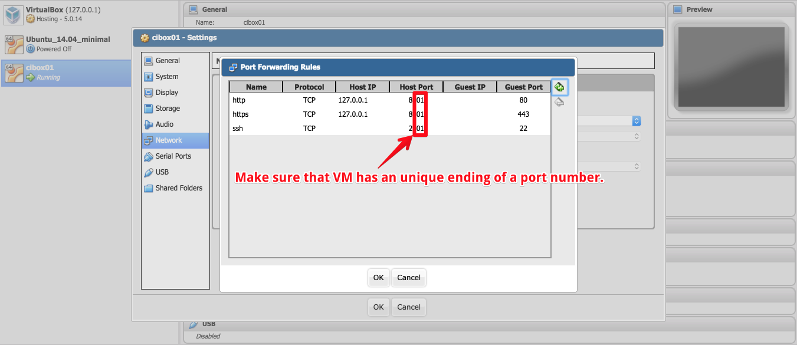

# Matrix

With this tool you able to create own matrix with virtual servers.

Let's describe a structure and technologies. First of all, we need to get acquainted with two basic terms: `host` and `droplet`.

- `host` - is a physical computer (server);
- `droplet` - is a virtual machine, located on the `host`.

As much as needed droplets can be created on a host machine (depending on hardware configuration, of course).

Host machine operates only by minimal set of software:

- VirtualBox
- NGINX
- PHP
- phpVirtualBox

Every virtual server has it own private network, which forwarding to a host. For example, you have 10 virtual server. Each of them forwards three ports to a host: `80<NN>`, `88<NN>` and `22<NN>` (`<NN>` - is a serial number of a virtual server). NGINX is listening every `8x<NN>` port on a host and forwards connection inside of VS. `80<NN>` forwards to 80, `88<NN>` - to 443. `22<NN>` forwards to 22, for SSH connections.

That's all! And that's cool! Every virtual server can be additionally provisioned by main `cibox` tool to convert it to CI server.

```ascii
  ████████╗ ██╗  ██╗ ███████╗     ███╗   ███╗  █████╗  ████████╗ ██████╗  ██╗ ██╗  ██╗
  ╚══██╔══╝ ██║  ██║ ██╔════╝     ████╗ ████║ ██╔══██╗ ╚══██╔══╝ ██╔══██╗ ██║ ╚██╗██╔╝
     ██║    ███████║ █████╗       ██╔████╔██║ ███████║    ██║    ██████╔╝ ██║  ╚███╔╝ 
     ██║    ██╔══██║ ██╔══╝       ██║╚██╔╝██║ ██╔══██║    ██║    ██╔══██╗ ██║  ██╔██╗ 
     ██║    ██║  ██║ ███████╗     ██║ ╚═╝ ██║ ██║  ██║    ██║    ██║  ██║ ██║ ██╔╝ ██╗
     ╚═╝    ╚═╝  ╚═╝ ╚══════╝     ╚═╝     ╚═╝ ╚═╝  ╚═╝    ╚═╝    ╚═╝  ╚═╝ ╚═╝ ╚═╝  ╚═╝
```

## Usage

Add your own host inside of `inventory` file and run the following command:

```shell
./cibox matrix/matrix.yml --limit=<HOSTNAME>
```

## Port forwarding




phpVirtualBox will be available on the domain which you have to [configure](matrix.yml#L5). Imagine that it is: `m2.propeople.com.ua`. As you can see on the screenshots, every port ends by `01`. This means that domain for VM will be `cibox01.propeople.com.ua`.

Why `cibox<NN>`? [Look there](matrix.yml#L6) for the answer.
